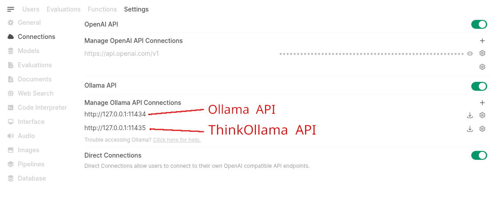
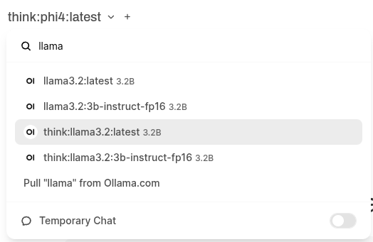

# ThinkOllama

ThinkOllama is a proxy for Ollama that adds reasoning capability to installed models.

It uses DeepSeek R1 (via Ollama) to generate reasoning and appends it to user queries before forwarding them to the target model.

Integrates as an Ollama service into OpenWebUI. 
By prefixing the available models installed in Ollama in order to distinguish between the standard Ollama models and the CoT-augmented versions, resolving model naming conflicts.

## Features

- **Ollama-Based DeepSeek R1 Integration:** Utilizes Ollama to run DeepSeek R1 for internal CoT generation and extraction.
- **Chain-of-Thought Extraction:** Extracts reasoning from DeepSeek responses and uses it to enhance other models response generation.
- **Model Prefixing for OpenWebUI Integration:** Prefixes available models to integrate both standard Ollama models and CoT-augmented versions, avoiding naming conflicts.
- **Configurable Ollama Endpoint in OpenWebUI:** Allows users to manually configure the Ollama API Base URL in OpenWebUI under **Admin Settings > Connections > Ollama** to connect with ThinkOllama.
- **API Endpoints:**
  - `POST /api/chat` — Processes chat messages, extracts CoT via DeepSeek through Ollama, and primes the model before returning responses.
  - `GET /api/tags` — Proxies requests to fetch available model tags from Ollama.
  - `GET /api/version` — Proxies requests to fetch the current version from Ollama.


## Running with Docker

To run **ThinkOllama** and **Ollama** in separate containers:

1. **Start the Ollama container (if you do not have ollama deployed already):**

   ```bash
   docker run -d \
     --name ollama \
     -v ollama:/root/.ollama \
     -p 11434:11434 \
     ollama/ollama
   ```

2. **Start ThinkOllama with Docker:**

   ```bash
    docker run -d \
        --name thinkollama \
        --add-host=host.docker.internal:host-gateway \
        -p 11435:11435 \
        -e OLLAMA_URL=http://host.docker.internal:11434 \
        -e DEEPSEEK_URL=http://host.docker.internal:11434 \
        -e DEEPSEEK_MODEL=deepseek-r1:14b \
        -e MODELS_PREFIX=think: \
        nyirocsaba/thinkollama:latest
   ```

3. **Verify connectivity:**

   ```bash
   docker exec -it thinkollama curl http://host.docker.internal:11434/api/tags
   ```

If this returns a list of models, ThinkOllama is successfully communicating with Ollama!

## Manual Installation (For Non-Docker Users)

1. **Clone the repository:**

   ```bash
   git clone https://github.com/nyirocsaba/thinkollama.git
   cd thinkollama
   ```

2. **Install dependencies:**

   ```bash
   pip install -r requirements.txt
   ```

## Configuration

Create a `.env` file in the repository root (you can start by copying the provided `.env.example`):

```bash
cp .env.example .env
```

Ensure your `.env` contains the necessary variables:

```
DEEPSEEK_URL=http://localhost:11434
OLLAMA_URL=http://localhost:11434
DEEPSEEK_MODEL=deepseek-r1:14b
MODELS_PREFIX=think:
```

## Running the Application

Start the FastAPI server using Uvicorn:

```bash
uvicorn src.thinkollama:app --host 127.0.0.1 --port 11435
```

## OpenWebUI Integration

To configure OpenWebUI to use ThinkOllama as its Ollama backend:

1. **Open OpenWebUI.**
2. Navigate to **Admin Settings > Connections > Ollama API**.
3. Add a new connection and set the **Ollama API Base URL** to `http://127.0.0.1:11435` (or the appropriate ThinkOllama address).

4. Save changes to apply the new configuration.
5. Check models list, you should have all the installed ollama models and all of them with think: (or your prefix set in .env) to query Ollama models through ThinkOllama.



### **Recommended OpenWebUI Settings**

For better performance and usability, we recommend changing the following setting in OpenWebUI:

- **Settings > Interface > Local Models**: Set this to **Direct Ollama Model** instead of **Current Model**. This ensures that CoT-augmented variants are not used for title and tag generations, as they consume more resources and may not be optimal for these tasks.

## API Usage

- **Chat Completion Endpoint**
  - **URL:** `/api/chat`
  - **Method:** `POST`
  - **Payload Example:**

    ```json
    {
      "model": "think:your-model-name",
      "messages": [
        {"role": "user", "content": "Your chat query here"}
      ],
      "stream": true
    }
    ```

- **Tags Endpoint**
  - **URL:** `/api/tags`
  - **Method:** `GET`

- **Version Endpoint**
  - **URL:** `/api/version`
  - **Method:** `GET`

## Contributing

Contributions are welcome! Please feel free to open issues or submit pull requests.

## License

This project is licensed under the MIT License. See the [LICENSE](LICENSE) file for details.
